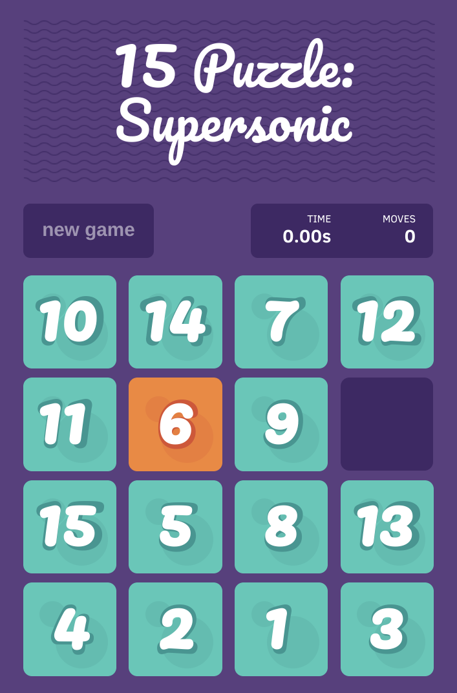

<h1 align="center">
<a href="https://github.com/imshubhamsingh/15-puzzle">
</a><br/><br/>
15 Puzzle: Supersonic 

</h1>
<h4 align="center">a mod for a simple React game</h4>
<p align="center">
</p>

> This is a classic _15_-_puzzle_ with enhanced timing.

<h1 align="center">

</h1>


## Features

- Precise timing: for speedsolvers, every hundredth of a second matters and is captured.
- Accurate timing: rather than relying on increments that drift, this mod records the actual time elapsed.
- Fuller scorekeeping: after a solve, both the move count and time are easily visible, so the two metrics can be recorded together.

<h1 align="center">

</h1>


## Play this mod

1. Change to preferred directory and ```git clone git@github.com:IonicSound/15-puzzle.git```
2. ```cd 15-puzzle```
3. ```npm start```; you may need to downgrade to node 12 instead of the most updated version

<h3 align="center">or</h3>

Play the game on a live demo (coming soon!)


## License [](https://github.com/imshubhamsingh/15-puzzle/blob/master/LICENSE)

Copyright (c) 2018 Shubham Singh

Copyright © 2025 IonicSound (modder)

This software is licensed under the [MIT License](https://github.com/imshubhamsingh/15-puzzle/blob/master/LICENSE).
